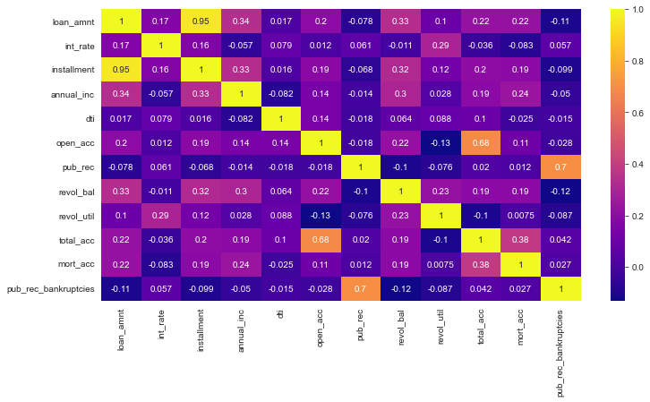
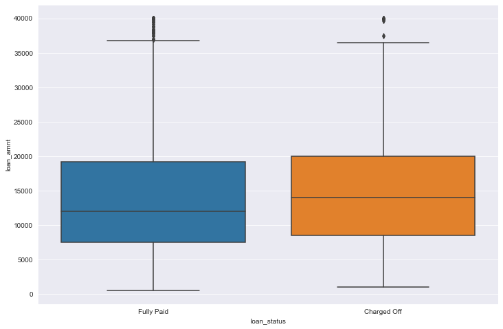
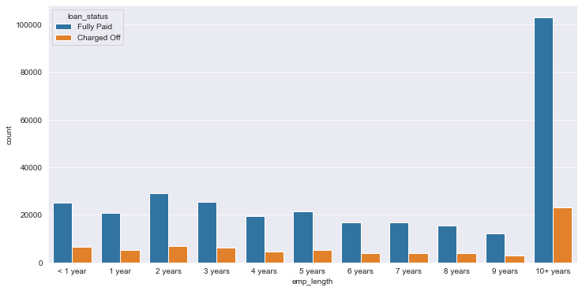

# Loan Default Prediction
Classifying each borrower as a defaulter or a defrayer using machine learning and deep learning models

## Lending Club
LendingClub is the world's largest peer-to-peer lending company, headquartered in San Francisco, California. It was the first peer-to-peer lender to register its offerings as securities with the Securities and Exchange Commission (SEC), and to offer loan trading on a secondary market. It operates as an online lending platform that enables borrowers to obtain a loan, and investors to purchase notes backed by payments on loans. 
LendingClub enables borrowers credit unsecured personal loans starting from as low as $1,000 to as large as $40,000. Investors can browse the loan listings from the website and invest based on the information provided by the borrower. Investors earn money through the interest on the loans and LendingClub earns by charging a service fee to the investors and an origination fee to the borrowers. 

## Motivation
LendingClub is transforming the banking system by making loans more affordable and investing much more rewarding. However one major issue is especially in peer-to-peer lending is loan defaulting i.e. the borrowers not being able to payback the loans. Hence there is a necessity to classify each borrower as a defaulter or a defrayer based on the data collected while issuing the loans.

## Goal
Given historical data on loans given out with information on whether or not the borrower defaulted (charge-off), we would build a model that can predict wether or nor a borrower will pay back their loan? This way in the future when a new potential customer arrives, we can assess whether or not they are likely to pay back the loan.

## Requirements

This project requires **Python** and the following Python libraries installed:

- [NumPy](http://www.numpy.org/)
- [Pandas](http://pandas.pydata.org/)
- [matplotlib](http://matplotlib.org/)
- [seaborn](https://seaborn.pydata.org/)
- [scikit-learn](http://scikit-learn.org/stable/)
- [tensorflow](https://www.tensorflow.org/)

You will also need to have software installed to run and execute a [Jupyter Notebook](http://jupyter.org/install.html).

If you do not have Python installed yet, it is highly recommended that you install the [Anaconda](https://www.anaconda.com/download/) distribution of Python  which already has the above packages and more included. However if you wish to run it online rather than your local machine you can use [Google Colab](https://colab.research.google.com/) which also has the necessary packages installed.

## Data

I have used a subset of the LendingClub dataset provided by [Kaggle](https://www.kaggle.com/wordsforthewise/lending-club) with the data starting from 2008 to 2016. The dataset contains about 396030 observations with each having 27 features such as loan_amount, interest_rate, installment etc. The target feature is the loan_status column which contains either of the two values fully-paid or charged-off. The raw dataset, processed data and a brief description of all the features can be downloaded from [here](https://drive.google.com/file/d/1SrzBD1Kj_O38f90hsubiRuqbLWwZa9LY/view?usp=sharing).

## Code 

There are two notebook files in the project, Data-Visualization-Preprocessing and Model-Creation-Training. The former contains the code for exploratory data analysis along with preprocessing the raw data so that it is suitable for training different machine learning models. The latter contains the code for training different machine learning and deep learning models. I have trained 4 models, Logistic Regression, K-Nearest Neighbors, Random Forest Classifier and a deep learning Neural network.

## Results

Few of the graphs generated from the dataset.

#### Correlation among all numeric features

#### Loan status vs Loan amount

#### Employment length vs the count of loans paid/charged-off

##### Note: Other visualization graphs can be found in the notebook files.

## Author

Myself Dhwanil Shah, pursuing my Btech (currently 3rd year) from DA-IICT, Gandhinagar and I'm passionate about Data science, Machine learning and Deep Learning. You can find me on [Linkedin](https://www.linkedin.com/in/dhwanil-shah-a115821ab/), I would love to collaborate on projects related to DS, ML and DL.

